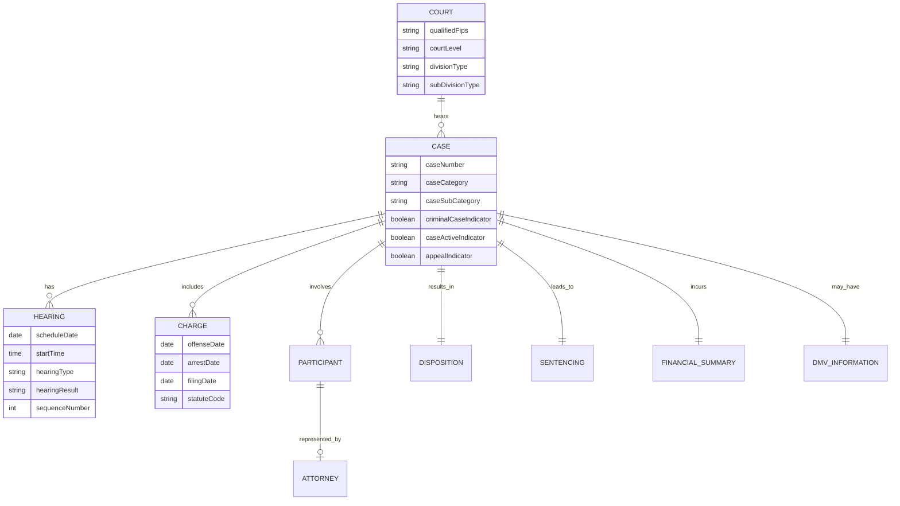

import Section from "@/components/mdx/Section.astro";
import Callout from "@/components/mdx/Callout.astro";

# Data Exploration: One Week of U.S. Court Data

<Section title="Scope">

### What this article is
This is a multi-part series taking a journey through U.S. legal data.

Before jumping into deep analysis or modeling, it is crucial to first understand the shape and semantics of our data. This exploratory phase is often the most insightful part of the process, allowing us to map out the complex domain of LegalTech.

<Callout type="tip" title="Why this matters">
**Volume & Complexity**: Legal data is not just text; it's a massive, structured graph of millions of events, people, and outcomes.
</Callout>

Our goals are to:
- Explore the data structure, values, and relationships with other datasets.
- Present the LegalTech data models found in the wild.
- Perform domain modeling and preliminary Exploratory Data Analysis (EDA).

### What this article is not
To manage expectations, we should be clear about what we are *not* doing. This is not a legal analysis, a policy critique, or a predictive modeling exercise. Furthermore, while we rely on scraped data, this is not a tutorial on scraping infrastructure (though we may explore that engineering challenge in a future post).

</Section>

## Dataset Documentation


### Court Identity
Every case belongs to a specific court context.
- **Location**: Qualified FIPS code.
- **Level**: Court level (e.g., "J").
- **Classification**:
    - `divisionType`: "A".
    - `subDivisionType`: "A".

### Case Data
The core metadata defining the case itself.
- **Identifiers**:
    - Case number: Unique identifier.
    - `appealCase`: Boolean flag indicating if this is an appeal.
- **Categorization**:
    - `caseCategory`: Contains the Code and Sub-Category.
    - `criminalCaseIndicator`: "Y" / "N".
- **Status**:
    - `caseActiveIndicator`: "Y" (often nested in a value object).

### Charges and Offenses
Details about what the defendant is actually accused of.
- **Dates**: Offense date, Arrest date, and Charge filing date.
- **Charge Details**:
    - Original charge description.
    - Amended charge (if applicable).
    - Relevant code section (law statute).

{/* QUESTION: Do we handle cases with multiple charges? The structure implies a list or single object? */}

### Disposition and Sentencing
How the case concluded and the resulting penalties.
- **Disposition**:
    - Date and Text code (e.g., "TR" for Transfer).
- **Probation**: Duration info.
- **Transfer**: Target court (e.g., "161G").
- **Sentencing**:
    - `sentence`: Structure containing details.
    - `sentenceSuspended`: Time suspended from the sentence.

### Financial Information
A breakdown of the financial impact.
- **Fines**: Amount, Suspended Amount, Imposed Amount, and Paid Indicator.
- **Restitution**: Amount ordered to be paid to victims.
- **Costs**: Court costs.

### Participants
The people and entities involved.
- **Defendant**:
    - `participantCode`: "DEF".
    - `contactInformation`: City, State, Country, Postal Code.
    - `personName`: Structured name fields (Given, Middle, Surname, Suffix).
    - `personalDetails`: Race, Gender, and Masked Birthdate (Year removed for privacy).
- **Attorney**:
    - `id`, `judicialOfficialCategoryText`, `attorneyName`.
- **Status**: `participantStatus`.

{/* NOTE: Participants can also be businesses/organizations, not just individuals. */}

### Hearing Data
An array of event data tracking the case timeline.
- `caseHearing`: List of past and upcoming hearings.
- **Fields**:
    - [ ] `pleadingAndOrder`
    - [ ] `serviceInfo`: Notice type, Date served, How served.
    - [ ] `continuanceCode`
    - [ ] `plea` / `duration`
    - [ ] `juryImpaneled`

## Data Modeling

### Conceptual Entity Model
The **Case** acts as our core observational unit. It exists within a **Court** context and acts as the parent entity for Hearings, Participants, and Charges.

{/* TODO: Expand on the difference between a "Case" and a "Hearing" as the primary unit of analysis. */}

### Entity Relationship Diagram



### Approach: JSON Schema

We will use the **JSON Schema** specification to document our data. It provides a trusted, standard way to explain structure, types, and required fields in a format that is both human-friendly and machine-readable.

{/* SUGGESTION: Link to json-schema.org for readers unfamiliar with the spec. */}

JSON Schema is the backbone of modern data validation. It supports advanced features like inheritance and conditional logic, and it is widely supported across ecosystems (JavaScript, Python, etc.), enabling features like editor Intellisense.

### Schema Generation
Manually writing a schema for such a complex dataset is error-prone. To automate this, we leverage tools like **[quicktype]** for smaller samples or **[Genson]** for larger, batched inputs.

For this project, we combined multiple JSONL files into a single master JSON file and ran:
`genson combined.json > schema.json`

**Caveats of Automation**:
Automated tools are powerful but naive. They often interpret Enums and Dates as simple `strings` because they lack semantic understanding. Required fields are inferred solely based on presence in the sample; if a field is missing in your specific sample set, the tool may incorrectly mark it as optional. Manual review and correction are always necessary.

```json
{
  "$schema": "http://json-schema.org/schema#",
  "type": "array",
  "items": {
    "type": "object",
    "properties": {
      "qualifiedFips": { "type": "string" },
      "courtLevel": { "type": "string" },
      "divisionType": { "type": "string" },
      "caseParticipant": {
        "type": "array",
        "items": {
          "type": "object",
          "properties": {
            "participantCode": { "type": "string" },
            "contactInformation": {
                 "type": "object",
                 "properties": { ... }
            }
            ...
          }
        }
      }
      ...
    }
  }
}
```

### Data Preparation & Normalization
Before diving into analysis, we need to clean and normalize the data to make it queryable.
- **Key Normalization**: Renaming keys to be consistent and descriptive.
- **Date Formatting**: Converting various string formats into standard Date objects.
- **Flattening**: Simplifying deeply nested value objects (e.g., `value: "Y"` wrappers).

### Cross-Referencing
Real insights come from joining this data with other sources:
- Court registries (for court metadata).
- Law codes / statutes (for charge definitions).
- DMV records.
- Attorney registries.

## Analysis Scope

We are limiting our initial scope to a **single week of data (first week of May 2024)**.

We have applied standard exclusions for sensitive data types, such as sealed cases, juvenile records, and expunged/confidential files. Privacy is paramount; all Personally Identifiable Information (PII) like birth years and specific street addresses has been anonymized or masked.


