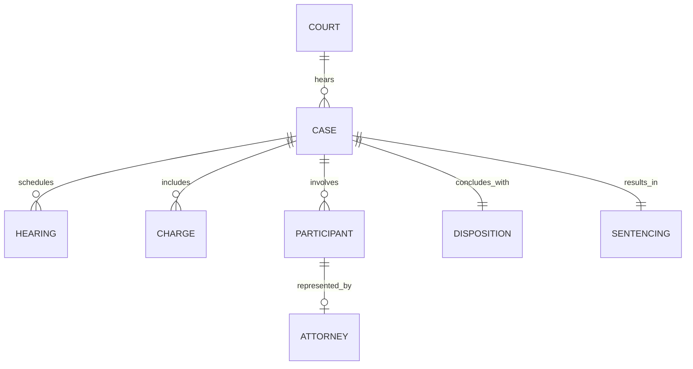

## Technical Overview

Part 2 of our series focuses on building an automated data engineering platform designed to ingest, validate, and structure fragmented public court data at scale.

```
+------------------+     +-------------------+     +------------------+     +-------------------+
|  State Court     | --> | Airflow Orchestr. | --> | JSONL Bronze     | --> | DuckDB Analytical |
|  Public Endpoints|     | (Retries/Proxies) |     | (System-of-Rec)  |     | (Silver/Gold DB)  |
+------------------+     +-------------------+     +------------------+     +-------------------+
```

---

## 1. Ingestion Mechanics & Anti-Fragility

Public court interfaces are notoriously fragile, unannounced in updates, and aggressively rate-limited:
- **Rate Limiting & Backoff:** Dynamic throttling, exponential backoff, and randomized request spacing to ensure polite collection.
- **Endpoint Anonymity & Proxy Management:** Rotating IP pools and user-agent hedging to prevent site degradation and avoid IP bans.
- **Payload Sanitization:** Inlining error handlers to capture HTML response drift without breaking pipeline execution.

---

## 2. Pipeline Orchestration with Apache Airflow

To guarantee reproducibility and state recovery across millions of court records:
- **DAG Design Pattern:** Decoupled ingestion tasks (Discovery $\rightarrow$ Fetch $\rightarrow$ Validate $\rightarrow$ Persist).
- **Failure Resilience:** Automated retries with jitter, alerting hooks, and daily execution windows corresponding to court calendar updates.
- **Idempotency:** Parameterized date-partitioned runs ensuring safe backfills and historical re-runs without record duplication.

---

## 3. Medallion Storage Architecture

We organize our storage layer into distinct Medallion tiers:

### Bronze Layer (JSON Lines / System-of-Record)
- **JSONL Format:** Append-only, line-delimited JSON objects allowing streaming validation and incremental loads.
- **Fault Tolerance:** Malformed records are isolated line-by-line without corrupting surrounding batch files.

### Silver & Gold Tiers (DuckDB Engine)
- **DuckDB Integration:** Embedded columnar OLAP engine enabling ultra-fast local SQL analytical queries.
- **Query-First Workflow:** Replacing memory-heavy Pandas raw loads with zero-copy SQL transformations directly over Parquet/JSONL files.

---

## 4. Data Modeling & Schema Evolution

Court records transition from unstructured HTML/JSON into a strongly typed relational graph.

### Entity Relationship Model



### Schema Discovery & Sanitization
- **Automated Inference:** Leveraging schema inference tools (`Genson`) to draft initial JSON Schemas across combined batches.
- **Type Flattening & Normalization:** Standardizing date formats, unwrapping nested status objects, and resolving missing enum values.
- **PII Hashing & Anonymization:** Applying non-reversible cryptographic hashes (e.g., SHA-256) to participant names and stripping exact birth dates prior to Silver tier promotion.

---

## Next Steps

In **Part 3**, we leverage our DuckDB Silver/Gold analytical layer to perform exploratory data analysis, run statistical hypothesis tests, and uncover operational patterns across courtroom dockets.
